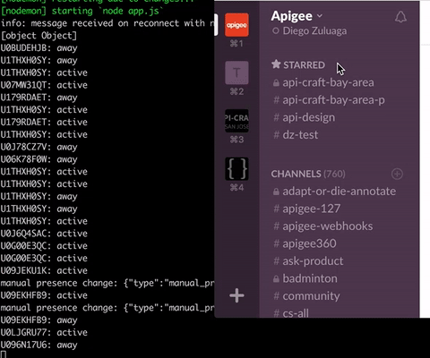
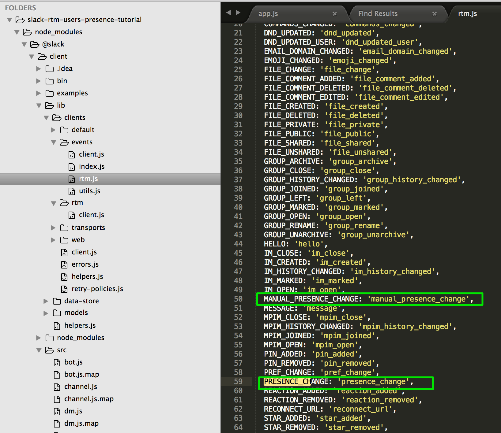

slack-rtm-users-presence-tutorial
==================================

### Use case
The Slack RTM(Real Time Messaging) API is especially useful when I want to receive a notification in real time when a user changes presence status, or others events are emitted. So, instead of long polling the API, and check if status changes say every 5 minutes, my app gets notified when an actual event happens. It may sound like a webhook; however, it is different in the sense that RTM API and clients leverage WebSockets, so the client keeps the WebSocket connection open.

<p align="center"></p>

#### What do I need to get started?

This tutorial leverages [Node Slack SDK](https://github.com/slackhq/node-slack-sdk#node-library-for-the-slack-apis). This repo provides some examples of how the SDK works, however, it lacks specific examples such as when a user changes presence status.


##### Step 1: Get a Slack Access Token
First of all, to get access to the RTM API events, you'll need a Slack access token that enables you to capture events happening in real time. The following explains how to create and retrieve API tokens: https://get.slack.help/hc/en-us/articles/215770388-Creating-and-regenerating-API-tokens

##### Step 2: Clone this repo and customize app.js to capture interesting events

```bash
git clone https://github.com/dzuluaga/slack-rtm-users-presence-tutorial.git
```

##### Step 3: Listen for RTM_EVENTS.PRESENCE_CHANGE in app.js

```javascript
var RtmClient = require('@slack/client').RtmClient;
var RTM_EVENTS = require('@slack/client').RTM_EVENTS;

var token = process.env.SLACK_API_TOKEN || '';

var rtm = new RtmClient(token);
//var rtm = new RtmClient(token, {logLevel: 'debug'});

rtm.on(RTM_EVENTS.PRESENCE_CHANGE, function (event) {

    //presence changed either by the user or by the client when the user becomes idle
    console.log(event.user + ': ' + event.presence);
});

rtm.on(RTM_EVENTS.MANUAL_PRESENCE_CHANGE, function (event) {

  // presence manually changed by the user
    console.log('manual presence change: ' + JSON.stringify(event) + ': ' + event.presence);
});

rtm.start();
```

##### Step 4: Start Node.js Client
```bash
$ SLACK_API_TOKEN={YOUR_TOKEN_HERE} nodemon app.js
```

### List of events captured by RTM API
This list of events comes handy to find other events supported by RTM API.



#### References

##### Listen to this event with RTM API
https://api.slack.com/events/presence_change